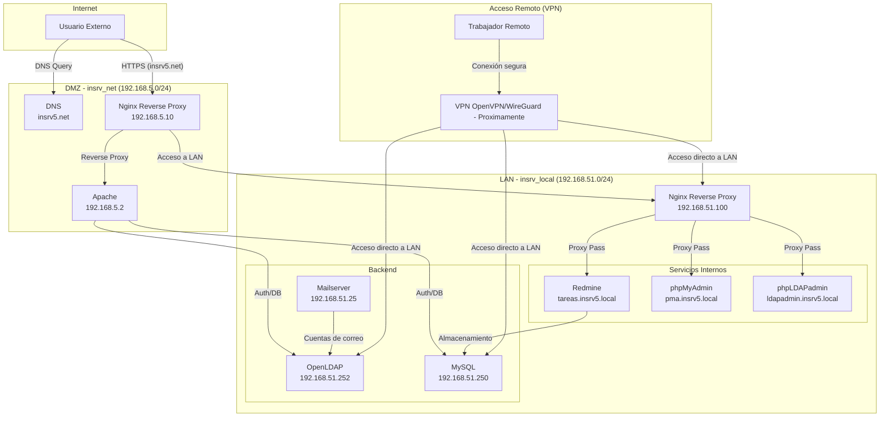

# 🚀 Infraestructura de Servicios IT con Docker

Proyecto de 2º de ASIR para simular una infraestructura TI empresarial completa utilizando contenedores Docker. El objetivo es desplegar, gestionar y securizar servicios de red, autenticación, bases de datos y aplicaciones internas.

**Estado del proyecto:** ⚠️ **En desarrollo.** La estructura base está implementada, pero la integración completa de servicios y la configuración de seguridad avanzada (como la VPN) están en proceso.

---

## 📋 Descripción del proyecto

Este proyecto replica un entorno corporativo mediante la orquestación de múltiples servicios con Docker. La arquitectura está segmentada en dos redes principales para simular una **zona desmilitarizada (DMZ)** y una **red de área local (LAN)**, garantizando que los servicios críticos no estén expuestos directamente a Internet.

El sistema incluye:

- **Servicios web públicos y privados** con Nginx como reverse proxy.
- **Autenticación centralizada** con OpenLDAP para usuarios y grupos.
- **Bases de datos** para aplicaciones internas como Redmine.
- **Herramientas de gestión web** para LDAP y MySQL (phpLDAPadmin, phpMyAdmin).
- **Servidor de correo** integrado con LDAP.
- **Sistema de gestión de proyectos** (Redmine).
- **Resolución de nombres DNS** para los dominios `insrv5.net` (público) y `insrv5.local` (interno).

---

## 🧱 Arquitectura de Red

La infraestructura se divide en dos redes aisladas para mejorar la seguridad:

| Red           | Subred            | Propósito                                       |
|---------------|-------------------|-------------------------------------------------|
| `insrv_net`   | `192.168.5.0/24`  | **DMZ (Zona Desmilitarizada):** Expone servicios al exterior (Nginx, DNS). |
| `insrv_local` | `192.168.51.0/24` | **LAN (Red Interna):** Aloja servicios críticos (LDAP, BBDD, Redmine, Mail). |

### 📐 Esquema de Arquitectura

---

## ⚙️ Descripción de Servicios

| Servicio       | Imagen                        | IP (insrv_local) | IP (insrv_net)  | Rol y Descripción                                                               |
|----------------|-------------------------------|------------------|-----------------|---------------------------------------------------------------------------------|
| **dns**        | `ubuntu/bind9`                | `192.168.51.253` | `192.168.5.253` | Servidor DNS. Resuelve `.local` para la LAN y `.net` para la DMZ.                 |
| **openldap**   | `osixia/openldap`             | `192.168.51.252` | -               | Servidor de autenticación centralizada (LDAP) para usuarios y grupos.             |
| **phpldapadmin**| `osixia/phpldapadmin`         | `192.168.51.4`   | -               | Interfaz web para gestionar OpenLDAP. Acceso interno vía Nginx (`ldapadmin.insrv5.local`). |
| **db**         | `mysql`                       | `192.168.51.250` | -               | Base de datos MySQL para aplicaciones como Redmine.                               |
| **phpmyadmin** | `phpmyadmin`                  | `192.168.51.3`   | -               | Interfaz web para administrar MySQL. Acceso interno vía Nginx (`pma.insrv5.local`). |
| **nginx**      | `nginx`                       | `192.168.51.100` | `192.168.5.10`  | **Reverse Proxy**. Dirige el tráfico de `insrv5.net` a Apache y expone servicios internos (`tareas.insrv5.local`). |
| **apache**     | (Build local)                 | `192.168.51.2`   | `192.168.5.2`   | Servidor web para aplicaciones PHP legacy o portales simples.                     |
| **mailserver** | `mailserver/docker-mailserver`| `192.168.51.25`  | -               | Servidor de correo completo (IMAP/SMTP) integrado con OpenLDAP para cuentas.      |
| **redmine**    | `redmine`                     | `192.168.51.10`  | -               | Plataforma de gestión de proyectos y tareas. Acceso vía Nginx (`tareas.insrv5.local`). |

---

## 🔐 Flujo de Funcionamiento y Seguridad

### Acceso de Usuarios Externos (`insrv5.net`)

1. Un usuario accede a `https://insrv5.net`.
2. El DNS público (`192.168.5.253`) resuelve el dominio a la IP del Nginx en la DMZ (`192.168.5.10`).
3. Nginx recibe la petición y, actuando como **reverse proxy**, la redirige al contenedor de Apache (`192.168.5.2`).
4. Apache procesa la lógica de la aplicación, que puede contactar con servicios de la LAN (como LDAP o MySQL) a través de sus IPs internas si es necesario.

### Acceso Remoto y Servicios Internos (`insrv5.local`)

1. El acceso a herramientas de gestión (`pma.insrv5.local`, `ldapadmin.insrv5.local`) y a la plataforma de tareas (`tareas.insrv5.local`) está restringido a la red interna.
2. Nginx (`192.168.51.100`) actúa como reverse proxy interno, protegiendo y centralizando el acceso a estos servicios.
3. **El acceso remoto para los trabajadores se realizará a través de una VPN**, que conectará al usuario de forma segura a la red `insrv_local`.

### Medidas de Seguridad

- **Segmentación de red (DMZ/LAN):** Los servicios críticos no tienen exposición directa a Internet.
- **Reverse Proxy (Nginx):** Actúa como único punto de entrada, ocultando la topología de la red interna y centralizando la gestión de SSL.
- **Comunicación cifrada:** Se utilizan certificados SSL/TLS para el acceso web (HTTPS) y para los servicios LDAP (LDAPS).
- **Acceso restringido por IP:** Las configuraciones de Nginx para los servicios internos (`insrv5.local.conf`) solo permiten el acceso desde las subredes autorizadas (`192.168.5.0/24`, `192.168.51.0/24`) y la futura VPN.
- **Autenticación Centralizada:** OpenLDAP gestiona todos los usuarios y grupos, evitando credenciales dispersas.

---

## 🔮 Próximos Pasos (Roadmap)

- [ ] **Integración de VPN:** Desplegar un contenedor (ej. `openvpn` o `wireguard`) para permitir el acceso remoto seguro a la red `insrv_local` desde cualquier lugar.
- [ ] **Sistema de Backups:** Implementar un servicio de copias de seguridad automáticas para la base de datos MySQL y los datos de OpenLDAP.
- [ ] **Monitorización y Logs:** Centralizar los logs de todos los contenedores y desplegar herramientas de monitorización (como Prometheus/Grafana).
- [ ] **Desarrollo de la aplicación PHP:** Finalizar la aplicación de gestión que se ejecuta en Apache.
