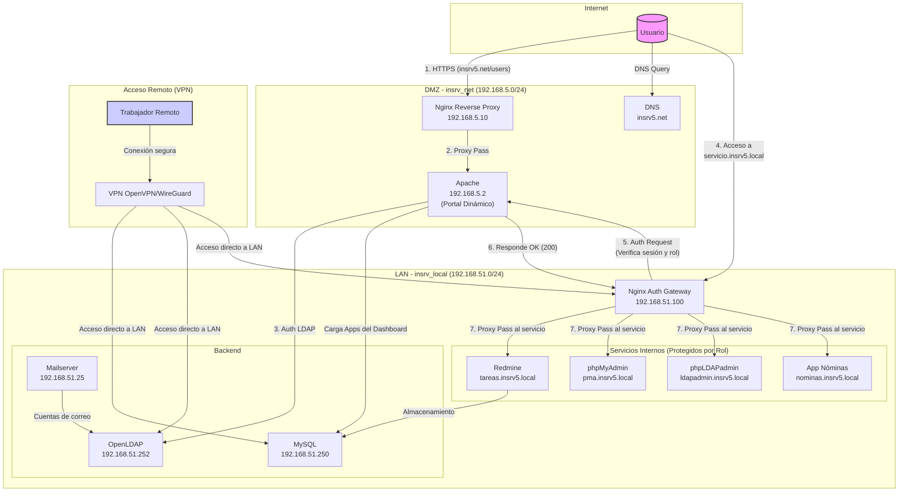

# 🚀 Infraestructura de Servicios IT con Docker

Proyecto de 2º de ASIR para simular una infraestructura TI empresarial completa utilizando contenedores Docker. El objetivo es desplegar, gestionar y securizar servicios de red, autenticación, bases de datos y aplicaciones internas.

**Estado del proyecto:** ✅ **Versión 2.0 - Funcional, Dinámico y Modular.** La arquitectura principal ha sido refactorizada para incluir un dashboard de aplicaciones dinámico gestionado por administradores desde la UI, un sistema de SSO robusto y un nuevo módulo de RRHH (Nóminas).

---

## 📋 Descripción del proyecto

Este proyecto replica un entorno corporativo mediante la orquestación de múltiples servicios con Docker. La arquitectura está segmentada en dos redes principales para simular una **zona desmilitarizada (DMZ)** y una **red de área local (LAN)**, garantizando que los servicios críticos no estén expuestos directamente a Internet.

El sistema incluye:

- **Portal de Empleados Dinámico:** Un dashboard con autenticación centralizada (OpenLDAP) y Single Sign-On (SSO). Las aplicaciones mostradas se cargan desde una base de datos y son **completamente gestionables (CRUD) por administradores** directamente desde la interfaz.
- **Servicios web públicos y privados** con Nginx como reverse proxy y gateway de autenticación.
- **Control de Acceso Basado en Roles (RBAC)** para proteger aplicaciones internas como Redmine, phpMyAdmin o el nuevo **Módulo de Nóminas**.
- **Bases de datos** para aplicaciones internas (MySQL).
- **Herramientas de gestión web** para LDAP y MySQL (phpLDAPadmin, phpMyAdmin).
- **Servidor de correo** integrado con LDAP.
- **Sistema de gestión de proyectos** (Redmine).
- **Resolución de nombres DNS** para los dominios `insrv5.net` (público) y `insrv5.local` (interno).

---

## 🧱 Arquitectura de Red

La infraestructura se divide en dos redes aisladas para mejorar la seguridad:

| Red           | Subred            | Propósito                                       |
|---------------|-------------------|-------------------------------------------------|
| `insrv_net`   | `192.168.5.0/24`  | **DMZ (Zona Desmilitarizada):** Expone servicios al exterior (Nginx, DNS, Portal Web). |
| `insrv_local` | `192.168.51.0/24` | **LAN (Red Interna):** Aloja servicios críticos (LDAP, BBDD, Redmine, Mail). |

### 📐 Esquema de Arquitectura

---

## ⚙️ Descripción de Servicios

| Servicio       | Imagen                        | IP (insrv_local) | IP (insrv_net)  | Rol y Descripción                                                               |
|----------------|-------------------------------|------------------|-----------------|---------------------------------------------------------------------------------|
| **dns**        | `ubuntu/bind9`                | `192.168.51.253` | `192.168.5.253` | Servidor DNS. Resuelve `.local` para la LAN y `.net` para la DMZ.                 |
| **openldap**   | `osixia/openldap`             | `192.168.51.252` | -               | Servidor de autenticación centralizada. La configuración (ej. cuenta de servicio) se gestiona de forma declarativa. |
| **phpldapadmin**| `osixia/phpldapadmin`         | `192.168.51.4`   | -               | Interfaz web para gestionar OpenLDAP. Acceso interno vía Nginx (`ldapadmin.insrv5.local`). |
| **db**         | `mysql`                       | `192.168.51.250` | -               | Base de datos MySQL para aplicaciones (Redmine, Portal de Empleados, Nóminas). |
| **phpmyadmin** | `phpmyadmin`                  | `192.168.51.3`   | -               | Interfaz web para administrar MySQL. Acceso interno vía Nginx (`pma.insrv5.local`). |
| **nginx**      | `nginx`                       | `192.168.51.100` | `192.168.5.10`  | **Reverse Proxy y Gateway de Autenticación**. Dirige el tráfico, gestiona SSL y protege los servicios internos con RBAC. |
| **apache**     | (Build local)                 | `192.168.51.2`   | `192.168.5.2`   | **Servidor del Portal de Empleados**. Gestiona el login, el dashboard dinámico (cargado desde la BD), el SSO, la API de gestión de apps y las `auth_request`. |
| **mailserver** | `mailserver/docker-mailserver`| `192.168.51.25`  | -               | Servidor de correo completo (IMAP/SMTP) integrado con OpenLDAP para cuentas.      |
| **redmine**    | `redmine`                     | `192.168.51.10`  | -               | Plataforma de gestión de proyectos. Acceso vía Nginx (`tareas.insrv5.local`). |
| **nominas**    | (Parte de `apache`)           | `192.168.51.2`   | -               | **Nuevo Módulo de Nóminas**. Accesible en `nominas.insrv5.local` y protegido por rol (RRHH, Admin). |

---

## 🔐 Flujo de Funcionamiento y Seguridad

### Flujo de Autenticación y Single Sign-On (SSO)

1. Un usuario accede a `https://insrv5.net` y es dirigido al portal de empleados (`/users/index.php`).
2. El portal de Apache valida las credenciales (usuario o email) contra el servidor OpenLDAP de forma segura (LDAPS).
3. Si la autenticación es correcta, se crea una sesión para el dominio `.insrv5.local` y se almacena el `uid` y el rol del usuario.
4. Se redirige al usuario al **dashboard dinámico**. El portal consulta la base de datos MySQL para obtener las aplicaciones a las que el usuario tiene acceso según su rol y las muestra como tarjetas interactivas.
5. Los **administradores (rol IT)** verán controles adicionales en el dashboard para añadir, editar o eliminar aplicaciones, gestionando así lo que el resto de empleados puede ver.
6. Desde el dashboard, el usuario puede hacer clic para acceder a servicios como `tareas.insrv5.local`. El sistema de SSO utiliza la sesión ya creada para darle acceso sin volver a pedirle credenciales.

### Acceso a Servicios Internos con RBAC

1. Cuando un usuario intenta acceder a un servicio interno (ej. `https://nominas.insrv5.local`), la petición es interceptada por el **Nginx Auth Gateway** en la LAN (`192.168.51.100`).
2. Nginx congela la petición y realiza una `auth_request` interna al portal de Apache, preguntando: *"¿Tiene este usuario (identificado por su cookie de sesión) alguno de los roles requeridos (ej. 'RRHH' o 'Administracion') para este recurso?"*
3. Apache verifica la sesión y el rol del usuario, y responde a Nginx con un código `200 OK` (si está autorizado) o `403 Forbidden` (si no).
4. Si la respuesta es `200`, Nginx permite el acceso y redirige la petición al servicio final. Si es `403`, muestra una página de acceso denegado.

### Medidas de Seguridad

- **Segmentación de red (DMZ/LAN):** Los servicios críticos no tienen exposición directa a Internet.
- **Reverse Proxy (Nginx):** Actúa como único punto de entrada, ocultando la topología de la red interna y centralizando la gestión de SSL.
- **Control de Acceso Basado en Roles (RBAC):** Nginx, en combinación con el portal de empleados, protege cada servicio interno, asegurando que solo usuarios con los privilegios adecuados puedan acceder.
- **Single Sign-On (SSO):** Mejora la experiencia de usuario y la seguridad al centralizar el punto de login.
- **Comunicación cifrada:** Se utilizan certificados SSL/TLS para el acceso web (HTTPS) y para los servicios LDAP (LDAPS).
- **Acceso restringido por IP:** Las configuraciones de Nginx y el dashboard verifican si el usuario proviene de una red interna o VPN, limitando el acceso a recursos sensibles.
- **Autenticación Centralizada:** OpenLDAP gestiona todos los usuarios y grupos, evitando credenciales dispersas.

---

## 🔮 Próximos Pasos (Roadmap)

- [ ] **Integración de VPN:** Desplegar un contenedor (ej. `wireguard`) para permitir el acceso remoto seguro a la red `insrv_local`.
- [ ] **Sistema de Backups:** Implementar un servicio de copias de seguridad automáticas para la base de datos MySQL y los datos de OpenLDAP.
- [ ] **Monitorización y Logs:** Centralizar los logs de todos los contenedores y desplegar herramientas de monitorización (como Prometheus/Grafana).
- [x] **Desarrollo del Portal de Empleados:** Finalizado. El portal ahora es un sistema dinámico con dashboard, SSO y gestión de aplicaciones vía API/Base de Datos.
